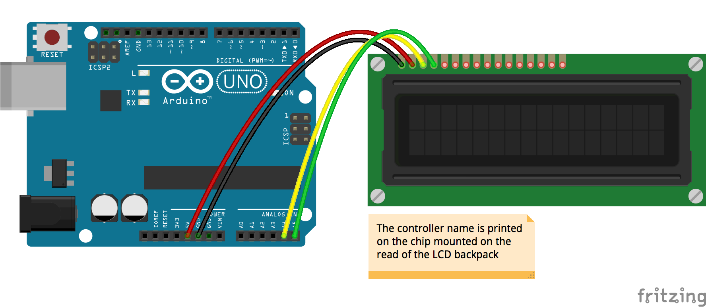

# IoT Weather Display
IoT Weather Display with Johnny-Five


### Breadboard for "LCD - I2C PCF8574"


### Demo
Run with:
```bash
node index.js
```

The `index.js` file:
```js
var five = require('johnny-five');
var board = new five.Board();
var _ = require('lodash');
var moment = require('moment');
var request = require('request');

var WeatherDisplay = function(lcd) {
    this.lcd = lcd;

    // Current weather data (http://openweathermap.org/current)
    // http://openweathermap.org/weather-data
    //
    // Examples:
    // http://api.openweathermap.org/data/2.5/weather?units=metric&q=Taipei
    this._fetchWeatherData = function(callback) {
        var querystring = require('querystring');
        var qs = querystring.stringify({
            'units': 'metric', // metric or imperial
            'q': 'Taipei' // city
        });
        var url = 'http://api.openweathermap.org/data/2.5/weather?' + qs;
        request(url, function(err, rsp, body) {
            if (err || rsp.statusCode !== 200) {
                err = err || new Error(body);
            }

            var data = JSON.parse(body);
            callback(err, data);
        });
    };

};

WeatherDisplay.prototype.load = function() {
    var lcd = this.lcd;

    lcd.clear();
    lcd.cursor(0, 0).print('Loading...');

    this._fetchWeatherData(function(err, data) {
        lcd.clear();

        if (err) {
            lcd.cursor(0, 0).print('Loading data failed.');
            return;
        }

        var name = _.get(data, 'name');
        var dt = moment(_.get(data, 'dt') * 1000).format('YYYY-MM-DD hh:mm:ss');
        var weather = _.get(data, 'weather[0].main');
        var temp = _.get(data, 'main.temp').toFixed(1);
            tempMin = _.get(data, 'main.temp_min').toFixed(1),
            tempMax = _.get(data, 'main.temp_max').toFixed(1);
        var humidity = _.get(data, 'main.humidity');
        var windSpeed = _.get(data, 'wind.speed') * 3600 / 1000; // m/s -> km/h

        lcd.cursor(0, 0).print(dt);
        lcd.cursor(1, 0).print(name + ' (' + weather + ')');
        lcd.cursor(2, 0).print('T:' + temp + ' (' + tempMin + '-' + tempMax + ')');
        lcd.cursor(3, 0).print('H:' + humidity + '%  W:' + windSpeed + 'km/h');
    });
};

board.on('ready', function() {
    // I2C LCD, PCF8574
    var lcd = new five.LCD({
        controller: 'PCF8574',
        rows: 4,
        cols: 20
    });
    var weatherDisplay = new WeatherDisplay(lcd);

    this.repl.inject({
        lcd: lcd,
        weatherDisplay: weatherDisplay
    });

    weatherDisplay.load();
});
```
